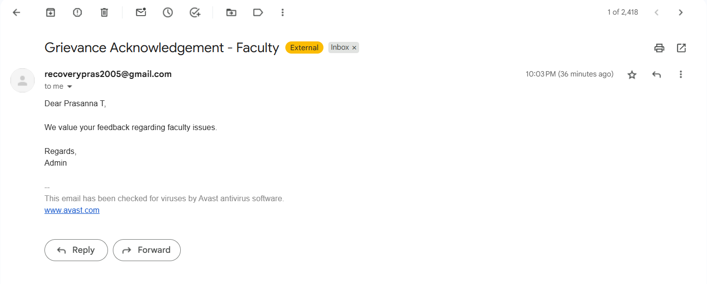

# SmartGrievance - Intelligent Grievance Management System

SmartGrievance is a **Flask-based web application** powered by advanced **NLP (Natural Language Processing)** to intelligently classify, prioritize, and acknowledge student grievances submitted via CSV (from Google Forms or manual upload).

> Built with modern Bootstrap UI, intelligent backend, and a responsive, table-based dashboard interface.

---

## Screenshots
🖼Below are the visual snapshots of SmartGrievance in action:

Login Page


Dashboard View 


Sample Grievance CSV Upload


Processed Grievances 


Email Acknowledgment 


<br><br>

---

## Features

-  Admin Login
-  Upload grievance CSV files directly

  -  Grievance classification (zero-shot learning).
  -  Named Entity Recognition (NER)
  -  Smart priority scoring
-  Auto-generated response per grievance
-  Email acknowledgment sender
-  Sortable table by **priority (high → low)**
-  Export processed data as new CSV
-  Super clean Bootstrap 5 UI
-  Secure credential management
-  Fully offline/local runnable

---

## Folder Structure
```
SmartGrievance/
│
├── app.py # Flask app entry point
├── nlp_backend.py # NLP logic (classification, priority, NER, email)
├── credentials.py # Admin and email credentials
├── processed/ # Stores processed exported CSVs
│
├── templates/ # HTML templates (Bootstrap)
│ ├── layout.html
│ ├── login.html
│ └── dashboard.html
│
├── static/
│ └── style.css # Custom styles
│
└── sample_grievances.csv # Example CSV for testing
```

---

## Sample CSV Format

You can upload any CSV file matching the below header structure. An example (`sample_grievances.csv`) is already provided.

### Required Columns:

```csv
Timestamp,Name of the student,Register Number,Department,Mail id,Brief Statement of Grievance,Written Complaint Submitted
```
How It Works (Tech Flow)

- Admin logs in using username/password.
- Uploads the student grievance CSV file.
- Backend NLP system:
  - Processes each grievance using:
    - Classifies grievance type using Zero-Shot Classification (facebook/bart-large-mnli)
    - Extracts named entities using NER (Named Entity Recognition)
    - Assigns a priority score based on:
    - Severity of the issue
    - Keyword frequency and context
    - Whether a "Written Complaint" was submitted
    - Auto-generates a suitable response email

4. Entries are displayed in a sortable table (high → low priority).

5. Admin can:

 -  Send email acknowledgments

 -  Export the processed results as a new CSV file

## Installation

1. Clone or Download
```
git clone https://github.com/yourusername/SmartGrievance.git
cd SmartGrievance
```
3. Install Dependencies
If using requirements.txt:

```
pip install -r requirements.txt
```
 Or install manually:
```
pip install flask pandas transformers scikit-learn torch
```

3. Setup Credentials

``` 
# credentials.py
USERNAME = "admin"
PASSWORD = "admin123"
EMAIL = "your_email@gmail.com"
PASSWORD = "your_email_password"
```

4. Run the Flask App
``` python app.py ```
Then open your browser and go to:
``` http://localhost:5000 ```

Exported Files
All processed results (grievance type, NER, priority, and response) will be saved to:
```
/processed/
```

NLP Models Used
- Zero-Shot Classification: facebook/bart-large-mnli
- Named Entity Recognition (NER): Babelscape/wikineural-multilingual-ner
- Other Libraries:
```
transformers
torch
pandas
smtplib
sklearn
collections
```

Email Format Example
```
Auto-generated email body sent to each student:

Subject: Grievance Acknowledgement - [Grievance Type]

Dear [Student Name],

We acknowledge your concern regarding [Grievance Type].

Regards,  
Admin
```

Future Enhancements
- Role-based dashboard (Admin, Staff, HOD)
- Add data visualization (charts, trends)
- SQLite/MySQL DB integration
- Public grievance submission form
- JWT-based session login
